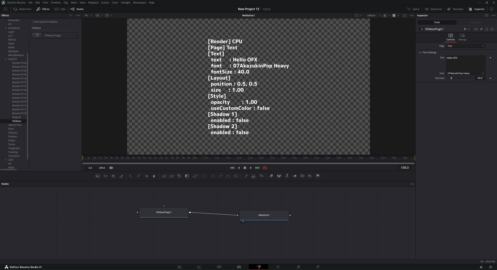
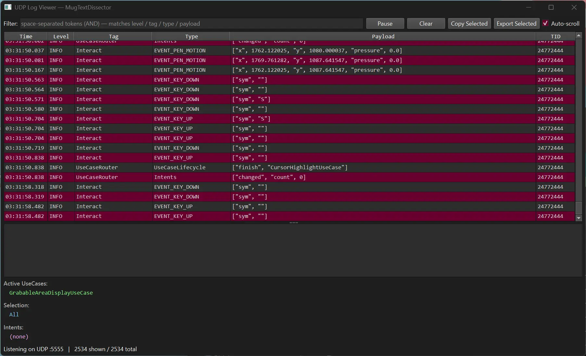

# OfxBase — テキスト系 OFX プラグイン開発テンプレート

[English](README.en.md)

テキスト系 OFX プラグインをすぐに開発し始めるためのテンプレートリポジトリです。
ビルドシステム・デバッグシステム・コア機能が実装済みで、インタラクション／描画／パラメータ定義のサンプルコードも含んでいます。

> [!NOTE]
> コードの詳細なドキュメントは整備されていません。
> 各クラスの役割や使い方を把握するには、リポジトリ全体を AI（Claude 等）に渡して解析してもらうのが最も手軽です。



---

## 含まれるもの

### サードパーティライブラリ

各ライブラリのライセンス全文は [3rdparty-licenses.md](3rdparty-licenses.md) を参照してください。

| ライブラリ | バージョン | ライセンス | 用途 |
|---|---|---|---|
| [OpenFX SDK](https://github.com/ofxa/openfx) | OFX_Release_1.5.1 | BSD-3-Clause | OFX プラグイン C++ ラッパー |
| [Blend2D](https://github.com/blend2d/blend2d) | latest | Zlib | 高品質 2D ベクタ描画エンジン（アンチエイリアス・テキスト対応） |
| [AsmJit](https://github.com/asmjit/asmjit) | latest | Zlib | Blend2D の JIT バックエンド |
| [utf8cpp](https://github.com/nemtrif/utfcpp) | v4.0.9 | BSL-1.0 | UTF-8 文字列処理 |
| [glaze](https://github.com/stephenberry/glaze) | v2.2.0 | MIT | JSON シリアライズ |
| [FreeType](https://github.com/freetype/freetype) | VER-2-14-3 | FTL | フォントラスタライズ |
| [HarfBuzz](https://github.com/harfbuzz/harfbuzz) | 14.2.0 | MIT | テキストシェーピング |

### ビルドシステム（`scripts/build.sh`）

- Docker コンテナによるクロスコンパイル（WSL2/Linux → Windows x64）
- macOS ネイティブビルドにも対応（`--mac` オプション）
- Ninja + ccache による高速インクリメンタルビルド
- リリース ZIP の自動生成（バンドル + インストーラ + ライセンスファイル同梱）
- トライアルビルドモード（`--trial`）と UDP ログ有効化（`--debug`）を切り替え可能

### デバッグシステム

- UDP 経由のログ送信（`src/debugger/LogManager`）— 構造化 JSON で送信
- Python 製 UDP ログビューア（`debugger/udp-viewer/`）— PyQt6 GUI、ポート 5555 で受信、フィルタ・CSV エクスポート対応

### コア実装

- **パラメータ系** (`src/params/`): Boolean / Choice / Double / Double2D / Int / RGBA / String / PushButton / Group など主要パラメータ型、ツリー構造による管理、条件付き表示制御（`VisibilityRule`）
- **インタラクション系** (`src/interaction/`): ペン/マウス/キーボード入力の抽象化、UseCase パターンによる振る舞いの分離、`HandlingRole` による優先度制御、Intent メタデータのログ送信
- **描画系** (`src/render/`, `src/overlay/`): Blend2D による CPU パスでのフレーム合成、OFX Draw Suite / OpenGL によるオーバーレイ描画
- **GPU プロセッサ系** (`src/processors/`): OpenCL（Windows/Linux）・Metal（macOS）によるオーバーレイ合成
- **フォント系** (`src/font/`): Win32 / macOS / Linux 各プラットフォーム対応フォント列挙、FreeType フェイスの LRU キャッシュ

### サンプル実装

- ドラッグ可能な UI 要素（`DragUseCase`、`GrabableAreaDisplayUseCase`）
- カーソルハイライト（`CursorHighlightUseCase`）
- ドラッグフィードバック（`DragFeedbackUseCase`）
- ボタンによるコマンド実行（`ResetPositionAndSizeCommand`）— Position / Size を初期値にリセット
- ショートカットキー（`ResetPositionAndSizeKeyUseCase`）— Alt+N で同じリセットを実行
- 主要パラメータ型の定義例（`ParameterManager`）

---

## プロジェクト構成

```text
.
├── CMakeLists.txt
├── cmake/
│   ├── toolchain.cmake          # Windows 向けクロスコンパイル設定（LLVM/Clang/LLD）
│   ├── mac-settings.cmake       # macOS ネイティブビルド設定（Apple M1、LTO）
│   └── Info.plist.in            # macOS バンドル用 Info.plist テンプレート
├── docker/
│   ├── Dockerfile               # ビルド環境（Ubuntu 24.04、LLVM 18、MinGW、各 SDK）
│   └── entrypoint.sh
├── scripts/
│   ├── build.sh                 # メインビルドスクリプト（Windows / macOS 両対応）
│   ├── docker-build.sh          # シンプルな Windows ビルド用スクリプト（旧版）
│   ├── rebuild_docker_image.sh  # Docker イメージ再作成
│   ├── setup-editor.sh          # エディタ用ヘッダー同期（.sdk/ に展開）
│   ├── install-win.bat          # Windows インストーラ
│   └── install-mac.command      # macOS インストーラ
├── debugger/
│   └── udp-viewer/              # UDP ログビューア（Python / PyQt6）
│       ├── viewer.py            # GUI 本体（フィルタ・カラーコード・CSV エクスポート）
│       ├── run.sh / run.bat     # 起動スクリプト
│       └── setup.sh / setup.bat # 依存関係セットアップ
└── src/
    ├── main.cc / main.h         # プラグインエントリポイント（OfxBasePlugin）
    ├── Version.h                # バージョン定数（1.0.0）
    ├── params/                  # パラメータ定義・管理
    │   ├── ParameterManager.h/cc
    │   ├── ParamIds.h           # パラメータ ID 定数
    │   └── core/                # パラメータ型・ツリー・可視性ルール
    ├── interaction/             # インタラクション（入力処理・UseCase）
    │   ├── Interact.h/cc        # OFX オーバーレイインタラクションのエントリ
    │   ├── UseCaseRouter.h/cc   # UseCase のライフサイクル管理・イベントルーティング
    │   ├── InteractionUseCase.h/cc  # UseCase 基底クラス
    │   ├── CurrentState.h / SnapshotState.h  # 実行時状態・スナップショット
    │   └── usecases/            # 具体的な UseCase 実装（Drag / Highlight / DragFeedback など）
    ├── overlay/                 # オーバーレイ描画
    │   ├── OverlayRenderer.h    # 描画インタフェース
    │   ├── OfxDrawSuiteRenderer # OFX Draw Suite 実装
    │   └── OpenGLRenderer       # OpenGL 実装（デフォルト無効）
    ├── render/                  # フレーム合成
    │   ├── Renderer.h/cc        # Blend2D CPU + GPU パスの合成処理
    │   └── CoordTransform.h     # 座標変換ヘルパー
    ├── processors/              # GPU コンポジター
    │   ├── OpenCLCompositor     # Windows / Linux 向け
    │   └── MetalCompositor      # macOS 向け（Objective-C++）
    ├── font/                    # プラットフォーム別フォント管理
    │   ├── FontManager.h/cc     # 共通インタフェース・LRU キャッシュ
    │   ├── Win32FontPlatform    # GDI フォント列挙
    │   ├── AppleFontPlatform    # CoreText フォント列挙
    │   └── LinuxFontPlatform    # Fontconfig フォント列挙
    └── debugger/                # UDP ログ送信
        └── LogManager.h/cc      # LOG_INFO / LOG_ERROR マクロ
```

---

## セットアップ

### WSL2 / Linux（Windows 向けビルド）

```bash
# Docker のインストール
curl -fsSL https://get.docker.com -o get-docker.sh
sudo sh get-docker.sh

# sudo なしで実行できるようにする
sudo usermod -aG docker $USER
newgrp docker
```

### macOS（ネイティブビルド）

以下が必要です。

```bash
# Xcode Command Line Tools（未インストールの場合）
xcode-select --install

# ビルドツール
brew install cmake ninja ccache

# Docker（Desktop でも Colima 等の代替でも可）
brew install colima docker
colima start
```

`build.sh --mac` 実行時に Docker イメージのビルドと `.sdk/` ヘッダーの同期が自動で行われます。

### エディタ設定（IntelliSense / clangd）

```bash
# コンテナ内 SDK ヘッダーをローカル (.sdk/) に同期（手動で実行する場合）
./scripts/setup-editor.sh
```

[clangd 拡張機能](https://marketplace.visualstudio.com/items?itemName=llvm-vs-code-extensions.vscode-clangd)を使用してください。Microsoft C/C++ 拡張機能が有効な場合は無効化することを推奨します。

---

## ビルド

```bash
# Windows 向けビルド（初回は Docker イメージを自動作成）
./scripts/build.sh

# macOS ネイティブビルド
./scripts/build.sh --mac

# オプション
./scripts/build.sh --debug    # UDP ログ有効化
./scripts/build.sh --trial    # トライアルビルド
./scripts/build.sh --clean    # ビルドディレクトリのみ削除（キャッシュ保持）
./scripts/build.sh --all      # ビルドディレクトリ + ccache を完全削除
```

**出力物:**
- プラグインバンドル: `build/win/OfxBase.ofx.bundle/` または `build/mac/OfxBase.ofx.bundle/`
- リリース ZIP: `build/for_windows_X.Y.Z.zip` / `build/for_mac_X.Y.Z.zip`（`--debug` なしの場合）
- エディタ用 DB: `build/compile_commands.json`

---

## インストール

### Windows

`build/win/` の内容（`OfxBase.ofx.bundle/`、`install-win.bat`、`3rdparty-licenses.md`）を同じフォルダに置き、`install-win.bat` をダブルクリックしてください（管理者権限が自動で要求されます）。

インストール先: `C:\Program Files\Common Files\OFX\Plugins\`

### macOS

リリース ZIP を展開し、`install-mac.command` をダブルクリックしてください。

インストール先: `/Library/OFX/Plugins/`

---

## UDP ログビューア

プラグイン側で `--debug` ビルドを有効にすると、UDP ポート 5555 にログが送信されます。

```bash
# 初回セットアップ（Python 仮想環境と PyQt6 を準備）
cd debugger/udp-viewer
./setup.sh        # macOS / Linux
setup.bat         # Windows

# 起動
./run.sh          # macOS / Linux
run.bat           # Windows
```

**機能:** ログのリアルタイム表示・フィルタ（AND 検索）・カラーコード（ERROR / WARN / INFO）・CSV エクスポート



---

## 開発用コマンド

```bash
# Docker イメージを完全に作り直す（SDK 更新時やイメージ破損時）
./scripts/rebuild_docker_image.sh
```
