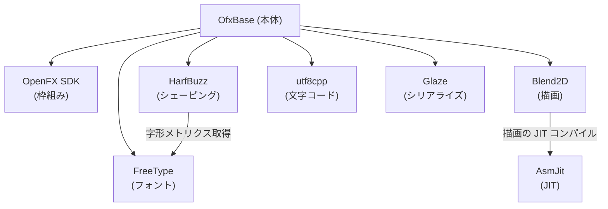
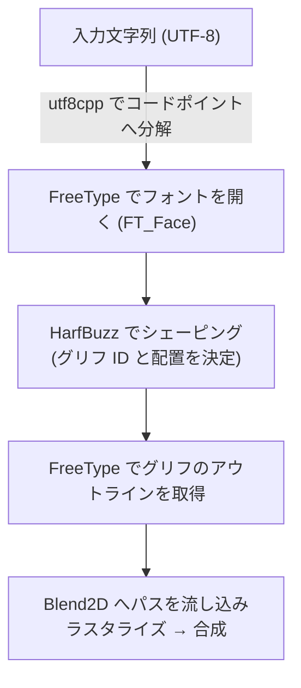

# サードパーティライブラリ解説

このドキュメントは、本プロジェクトが利用しているサードパーティ製ライブラリについて、
**何のために必要なのか**・**なぜそのライブラリを選んだのか**・**どこでどう使われているか**を解説するものです。

ライセンス全文は [3rdparty-licenses.md](../3rdparty-licenses.md) を参照してください。
CMake 上での解決ロジック（探索パス・ビルド/プリビルドキャッシュの切り替え）は
[CMakeLists.txt](../CMakeLists.txt) を参照してください。

## 全体像

このプラグインは「テキストを高品質にレンダリングして OFX ホスト上に合成する」ことを核としています。
そのため、ライブラリ群は大きく次の役割に分かれます。

| 役割 | 担当ライブラリ |
|---|---|
| OFX プラグインの枠組み | OpenFX SDK |
| フォントの読み込み・グリフ取得 | FreeType |
| テキストシェーピング（字形配置） | HarfBuzz |
| 2D ベクタ描画・ラスタライズ | Blend2D（+ AsmJit） |
| 文字コード処理 | utf8cpp |
| 設定・状態のシリアライズ | Glaze |

依存関係を図示すると次のようになります。

- **HarfBuzz は FreeType に依存**します（フォントフェイスから字形メトリクスを取得するため）。
- **Blend2D は AsmJit に依存**します（描画パイプラインを実行時に JIT コンパイルするため）。

ライブラリ間の処理の流れ（テキスト1行を描くまで）は以下の通りです。

---

## OpenFX SDK

- **バージョン**: `OFX_Release_1.5.1`
- **ライセンス**: BSD-3-Clause
- **リポジトリ**: https://github.com/ofxa/openfx
- **形態**: C++ Support ライブラリをソースからビルド（[CMakeLists.txt](../CMakeLists.txt#L135-L156)）

### 何のために必要か

OpenFX (OFX) は、DaVinci Resolve・Nuke・After Effects（OFX 対応版経由）などの
映像ホストアプリケーションが共通で読み込めるプラグイン規格です。
本プロジェクトの成果物 `OfxBase.ofx` はこの規格に従ったプラグインであり、
SDK なしには成立しません。

SDK には大きく2層あります。

- **C API（`include/`）**: ホストとプラグインの ABI 境界となる純 C インタフェース。
- **C++ Support ライブラリ（`Support/`）**: 上記 C API を `OFX::ImageEffect` などの
  クラスでラップしたもの。本プロジェクトはこの C++ 層を基盤に実装しています。

### なぜ採用したか

OFX はホスト非依存でプラグインを書ける事実上の業界標準であり、
1つのバイナリで複数ホストに対応できます。公式 SDK を使うことで規格準拠が保証されます。

### 使われ方

- プラグインエントリポイント `src/main.cc`（`OfxBasePlugin`）
- パラメータ定義 `src/params/`
- オーバーレイインタラクション `src/interaction/Interact.cc`（`OFX::Interact` 由来）

CMake では `ofxsupport` という静的ライブラリとしてビルドし、本体にリンクしています。

---

## FreeType

- **バージョン**: `VER-2-14-3`
- **ライセンス**: FTL（FreeType License。本プロジェクトは GPLv2 ではなく FTL を選択）
- **リポジトリ**: https://github.com/freetype/freetype
- **形態**: ソースからビルド（[CMakeLists.txt](../CMakeLists.txt#L184-L201)）

### 何のために必要か

フォントファイル（TrueType / OpenType 等）の **メタデータにアクセスする**ために採用しました。

描画エンジンの Blend2D 自体もフォントの読み込みは可能ですが、本プロジェクトでは
SFNT `name` テーブルから取得するファミリ名・サブファミリ名や、Variable Font の
名前付きインスタンス（バリエーション軸）といった**フォントファイルのメタデータ**に
踏み込んでアクセスする必要があり、これを Blend2D だけでは賄えませんでした。
そのため FreeType を導入し、**そのままグリフのアウトライン（ベジェ曲線）取得にも
使用しています**。描画はここで得たアウトラインを Blend2D に渡して行います。

具体的には次のような FreeType API を利用しています（[FontManager.cc](../src/font/FontManager.cc)）。

- `FT_Get_Sfnt_Name` / `FT_Get_Sfnt_Name_Count`: SFNT `name` テーブルから
  ファミリ名・サブファミリ名などを言語別に取得（`getSfntFamilyName` 等）
- `FT_Get_MM_Var` / `FT_Set_Var_Design_Coordinates`: Variable Font の
  名前付きインスタンスの列挙と軸座標の適用

### なぜ採用したか

- フォントメタデータ（SFNT name テーブル・Variable Font 情報）へ細かくアクセスできる。
- フォントラスタライザのデファクトスタンダードで、対応フォーマットが広く品質も実績十分。
- FTL ライセンスは商用配布に適しており、GPL 感染を避けられます
  （本プロジェクトは明示的に FTL を選択しています）。
- HarfBuzz と組み合わせる構成が一般的で、相互運用が確立しています。

### ビルド設定上の注意

CMake では不要な外部依存を切っています（[CMakeLists.txt](../CMakeLists.txt#L191-L196)）。

- `FT_DISABLE_ZLIB` / `FT_DISABLE_BZIP2` / `FT_DISABLE_PNG` / `FT_DISABLE_BROTLI`: 圧縮・画像系の依存を除去
- `FT_DISABLE_HARFBUZZ` / `FT_WITH_HARFBUZZ OFF`: **FreeType → HarfBuzz の逆依存を切る**。
  本プロジェクトの依存方向は HarfBuzz → FreeType の一方向に固定し、循環を避けています。

### 使われ方

- `src/font/FontManager`: フォントフェイス（`FT_Face`）の LRU キャッシュ
- 各プラットフォームのフォント列挙結果から FreeType でフェイスを開く

---

## HarfBuzz

- **バージョン**: `14.2.0`
- **ライセンス**: MIT（"Old MIT" / MIT-like）
- **リポジトリ**: https://github.com/harfbuzz/harfbuzz
- **形態**: ソースからビルド（[CMakeLists.txt](../CMakeLists.txt#L203-L226)）
- **依存**: FreeType

### 何のために必要か

**テキストシェーピング**を担います。シェーピングとは、文字列（コードポイント列）を
実際に描画すべき**グリフ列とその配置（位置・送り幅）**へ変換する処理です。
単純な1文字=1グリフでは扱えない以下を正しく処理するために必須です。

- 合字（リガチャ、`fi` → `fi` など）
- 結合文字・ダイアクリティカルマーク
- カーニング・字間調整
- アラビア語などの文脈依存字形、複雑なスクリプト

### なぜ採用したか

OpenType シェーピングの事実上の標準実装であり、Chrome・Android・LibreOffice 等でも
採用されている信頼性の高いライブラリです。FreeType との連携も標準的です。

### ビルド設定上の注意

外部 UI/ロケール依存を切り、FreeType 連携のみ有効化しています（[CMakeLists.txt](../CMakeLists.txt#L210-L221)）。

- `HB_HAVE_FREETYPE ON`: FreeType フェイスから字形情報を取得
- `HB_HAVE_GLIB OFF` / `HB_HAVE_ICU OFF` / `HB_HAVE_GOBJECT OFF`: 不要な外部依存を除去
- Windows ビルドでは `HAVE_MMAP` 等の POSIX API 検出を明示的に無効化（クロスコンパイル時の誤検出回避）

---

## Blend2D

- **バージョン**: `master`（latest）
- **ライセンス**: Zlib
- **リポジトリ**: https://github.com/blend2d/blend2d
- **形態**: ソースからビルド・静的リンク（[CMakeLists.txt](../CMakeLists.txt#L158-L182)）
- **依存**: AsmJit

### 何のために必要か

**2D ベクタ描画エンジン**です。FreeType から取り出したグリフアウトラインや、
オーバーレイ・図形を、高品質なアンチエイリアス付きでラスタライズし、
フレームへ合成します（CPU パス）。

### なぜ採用したか

主な競合は **Skia** です。Skia は GPU 描画に対応しパフォーマンス面で有利ですが、
以下の懸念から見送りました。

- **組み込みの難易度**: プロジェクトへ組み込むためのビルド設定が複雑。
- **バイナリサイズ**: ビルド後のバイナリが大きくなり、配布バンドルの肥大化を招く。

その他の GPU 描画ライブラリも検討しましたが、本プロジェクトの要件（テキスト描画品質・
機能）を満たせないものが多く、最終的に **CPU 描画で最も高品質と思われる Blend2D** を
採用しています。Blend2D を選んだ具体的な利点は以下の通りです。

- 高品質なアンチエイリアスと高速なラスタライズ性能を両立。
- AsmJit による JIT バックエンドで描画パイプラインを実行時最適化でき、CPU 描画が高速。
- Zlib ライセンスで商用配布に制約が少ない。
- テキストレンダリング向けの機能（パス・塗り・合成モード）が揃っている。

> [!NOTE]
> Skia は GPU 描画によるパフォーマンスの優位があるため、将来的に描画負荷が問題に
> なった場合は再検討の余地があります。現状は品質・組み込みやすさ・バイナリサイズの
> バランスから Blend2D を選択しています。

### この選択がもたらす副次的な利点

テキスト描画自体を CPU 側（Blend2D）で完結させたことで、**GPU 側に求められる役割が
「Blend2D が描いたテキストオーバーレイをソース映像へ重ね合わせるだけ」に単純化**されています。

その結果、GPU シェーダーの実装が非常に簡単になっています。`src/processors/` の
GPU コンポジター（macOS は Metal、Windows / Linux は OpenCL）は、いずれも
Blend2D が出力した PRGB32 オーバーレイを Porter-Duff Over で合成するだけの
カーネルで済んでいます（[MetalCompositor.mm](../src/processors/MetalCompositor.mm) /
[OpenCLCompositor.cc](../src/processors/OpenCLCompositor.cc)）。複雑な字形ラスタライズや
アンチエイリアスを GPU シェーダーで実装する必要がありません。

### ビルド設定上の注意

[CMakeLists.txt](../CMakeLists.txt#L168-L171) で以下を設定。

- `BLEND2D_STATIC ON`: 静的リンク。配布バンドルを単一ファイルに保ち、`BL_STATIC` 定義を伝播。
- `BLEND2D_TEST OFF` / `BLEND2D_SAMPLES OFF`: テスト・サンプルのビルドを抑止。

### 使われ方

- `src/render/Renderer.cc`: Blend2D による CPU パスのフレーム合成
- オーバーレイ描画やテキスト描画のラスタライズ全般

---

## AsmJit

- **バージョン**: `master`（latest）
- **ライセンス**: Zlib
- **リポジトリ**: https://github.com/asmjit/asmjit
- **形態**: Blend2D の依存として解決（[CMakeLists.txt](../CMakeLists.txt#L43-L52)）

### 何のために必要か

**実行時に機械語を生成（JIT コンパイル）するライブラリ**です。
本プロジェクトが直接呼び出すことはなく、**Blend2D の内部バックエンド**として使われます。
Blend2D は描画パイプラインを実行時に最適化したコードへ JIT し、ラスタライズを高速化します。

### なぜ採用したか

Blend2D が前提とする依存であり、これがないと Blend2D の JIT パスが機能しません。
AsmJit も同じ作者群（Petr Kobalicek）によるもので、Blend2D との相性が保証されています。

---

## utf8cpp

- **バージョン**: `v4.0.9`
- **ライセンス**: BSL-1.0（Boost Software License）
- **リポジトリ**: https://github.com/nemtrif/utfcpp
- **形態**: ヘッダオンリー（[CMakeLists.txt](../CMakeLists.txt#L76-L85)）

### 何のために必要か

OFX ホストやパラメータから渡される文字列は UTF-8 です。これを
**コードポイント単位で安全に分解・反復・検証**するために使います。
分解したコードポイントは HarfBuzz / FreeType に渡されます。

### なぜ採用したか

- ヘッダオンリーで導入が容易、追加ビルドが不要。
- BSL-1.0 は非常に寛容なライセンス。
- 不正な UTF-8 シーケンスの検出など、堅牢な文字コード処理を簡潔に書ける。

---

## Glaze

- **バージョン**: `v2.2.0`
- **ライセンス**: MIT
- **リポジトリ**: https://github.com/stephenberry/glaze
- **形態**: ヘッダオンリー（[CMakeLists.txt](../CMakeLists.txt#L65-L74)）

### 何のために必要か

C++ 構造体と **JSON のシリアライズ／デシリアライズ**を行います。
本プロジェクトでは特に、デバッグ用 UDP ログを構造化 JSON として送出する箇所
（`src/debugger/LogManager`、Intent メタデータのログ送信など）で使われます。

### なぜ採用したか

- ヘッダオンリーでビルド不要、導入が容易。
- リフレクションベースで、構造体への JSON マッピングを最小限の記述で書ける。
- 高速かつ MIT ライセンスで配布に制約が少ない。

---

## 依存の解決方法（共通）

すべてのライブラリは、CMake が以下の優先順位でソース／プリビルドを探索します。

1. `${CMAKE_CURRENT_SOURCE_DIR}/3rdparty/<lib>`（リポジトリ同梱）
2. `/opt/3rdparty/<lib>`（Docker イメージ内に配置されたもの）
3. `${SDK_DIR}/<lib>`（`.sdk/`、エディタ同期用）

ビルド済みの静的ライブラリ（`build/cache/<lib>/<arch>/*.a`）が存在する場合は
それを `IMPORTED` ライブラリとして再利用し、ビルド時間を短縮します
（ofxsupport / Blend2D / FreeType / HarfBuzz が対象）。

---

## ライセンスまとめ

| ライブラリ | ライセンス | 配布上の主な義務 |
|---|---|---|
| OpenFX SDK | BSD-3-Clause | 著作権表示の保持 |
| Blend2D | Zlib | 出自の非詐称・告知保持 |
| AsmJit | Zlib | 出自の非詐称・告知保持 |
| utf8cpp | BSL-1.0 | 著作権表示の保持（オブジェクトコードのみなら不要） |
| Glaze | MIT | 著作権・許諾表示の保持 |
| FreeType | FTL | FreeType 利用の明記（クレジット） |
| HarfBuzz | MIT (Old MIT) | 著作権表示の保持 |

いずれも商用配布が可能なライセンスです。配布物にはライセンス全文
（[3rdparty-licenses.md](../3rdparty-licenses.md)）を同梱してください。
リリース ZIP には自動で同梱されます。
